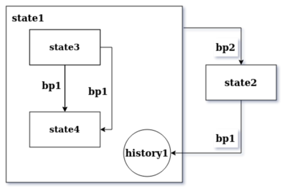

# StateMachine
StateMachine is a simple state machine, in Qt's State Machine framework style.


## Presentation

Here is the repo address:
https://github.com/MatioRIGARD/StateMachine/

This StateMachine framework works the same as Qt's State Machine framework. You can find a complete documentation here for the Qt version:
https://doc.qt.io/qt-5/statemachine-api.html

To make the code working, I've used the `signal.js` framework of `yeliu84`. I've integrated the necessary code in the file `StateMachine.js`. This way you only need to include one file in your html code to make it work.
You can find the `yeliu84` original code with explainations here:
https://github.com/yeliu84/signal.js
And here is a concrete interractive example:
http://plnkr.co/edit/pGs57j?p=preview&preview

This framework allow you to create hierachical state machines.
A state you create can include as much states in it. You can create states inside the second one, etc...
To transit from a state to another, you have to add transitions to states.
You can also create history states to come-back to a previous state after an interruption.

## Advantages

I created this because I haven't found something like this in js.
I tried xstate you can find here that seemed to be a good thing:
https://xstate.js.org/

But:
-It seemed too hard and strange to use to me.
-It looked difficult to edit dynamicly.
-The hierachy functionality seemed less robust and less powerful than the Qt one.

I found other libs but they doesn't seemed to support hierarchy.

## How to use

You only need to download this repo and include `jquery` and the `StateMachine` class in your html file.

add these lines in the begining of your code:

```html
<script src="https://cdnjs.cloudflare.com/ajax/libs/jquery/3.5.1/jquery.min.js"></script>
<script src="StateMachine/StateMachine.js"></script>
```

If you already included the `ỳeliu84` framework, you can include the minimal version of StateMachine instead:

```html
<script src="https://cdnjs.cloudflare.com/ajax/libs/jquery/3.5.1/jquery.min.js"></script>
<script src="StateMachine/StateMachine.min.js"></script>
```

For these explainations, we'll create this state machine:




First, you need to create states:

```javascript
let state1 = new State();
let state2 = new State();
```

To create a state that is inside another, pass the parent state in parameter of the new one:

```javascript
let state3 = new State(state1);
let state4 = new State(state1);
```

You can add transitions to pass from a state to another. In this example, we go from `state3` to `state4` when a signal `clickedSignal` is emited from an object named `bp1`. See the `signal.js` class for more details about the signals and slots lib I use.

```javascript
state3.addTransition(bp1, bp1.clickedSignal, state4);
state4.addTransition(bp1, bp1.clickedSignal, state3);
```

Here, you can create an history state to make possible a return to a previous state. Pass the state you want it to keep history.

```javascript
let history1 = new HistoryState(state1);
```

You can transit for example from `state1` to `state2` using another signal and from `state2` to the `state1`'s history state:

```javascript
state1.addTransition(bp2, bp2.clickedSignal, state2);
state2.addTransition(bp1, bp1.clickedSignal, history1);
```

Next, create the state machine:

```javascript
let myStateMachine = new StateMachine();
```

Add the states you want to your state machine. (You only need to add the most encompassing states, here `state1` and `state2`)

```javascript
myStateMachine.addState(state1);
myStateMachine.addState(state2);
```

Now, you need to set the initial states of the state machine and of the states that contains anothers:

```javascript
state1.setInitialState(state3);
myStateMachine.setInitialState(state1);
```

To connect functions to events, you can connect the `sEntered` and `sExited` signals of the states to a method of the object you want:

```javascript
state1.sEntered.connect(test.onEntered, test);
state1.sExited.connect(test.onExited, test);
```

Finaly, you can start the state machine:

```javascript
myStateMachine.start();
```

## Example

You can find a complete example for this state machine in the file `example.html` in the framework folder for this state machine:


## Links

Qt framework explainations:
https://doc.qt.io/qt-5/statemachine-api.html

The `yeliu84` signals and slot code:
https://github.com/yeliu84/signal.js

